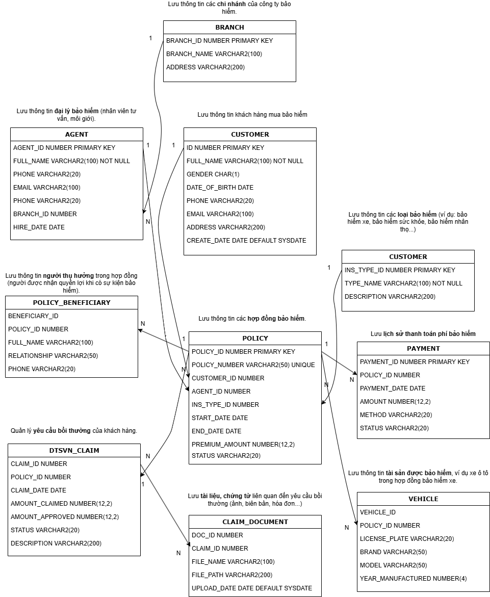

# 🏥 Insurance Contract Management (Microservices)

Dự án Microservices quản lý hợp đồng bảo hiểm được xây dựng trên nền tảng **.NET Core 9**, áp dụng kiến trúc **Event-Driven** và mô hình **CQRS**.

## 🛠 Tech Stack
* **Framework:** .NET Core 9 (Web API)
* **Database (Write):** Oracle SQL (Stored Procedures CRUD)
* **Database (Read):** MongoDB (High-speed query)
* **Message Broker:** RabbitMQ (Asynchronous data sync)
* **Infrastructure:** Docker & Docker Compose

## 📐 System Architecture
To visualize the flow of **Event-Driven Architecture** and **CQRS** in this project:



## ✨ Key Technical Highlights
* **CQRS Pattern:** Tách biệt luồng ghi (Write) vào Oracle và luồng đọc (Read) vào MongoDB để tối ưu hiệu năng.
* **Real-time Sync:** Sử dụng RabbitMQ Producer/Consumer để đồng bộ dữ liệu giữa hai cơ sở dữ liệu ngay khi có thay đổi.
* **Containerization:** Toàn bộ hạ tầng (MongoDB, RabbitMQ) và ứng dụng được đóng gói qua Docker, giúp triển khai đồng nhất.

## 🚀 How to Run

### 1. Khởi động hạ tầng (Infrastructure)
Tại thư mục gốc của dự án, mở Terminal và chạy lệnh:
```bash
docker-compose up -d
MongoDB Connection: mongodb://localhost:27017

RabbitMQ Management: http://localhost:15672 (Guest/Guest)

2. Chạy ứng dụng (Application)
Bạn có thể truy cập API tùy theo cách khởi chạy:

Chạy Local (Visual Studio / dotnet run):

Mở file .sln và chạy dự án.

API endpoint: http://localhost:5058

Chạy qua Docker Container:

API endpoint: http://localhost:8080

Dự án được thực hiện bởi Hoàng Nam - .NET Developer